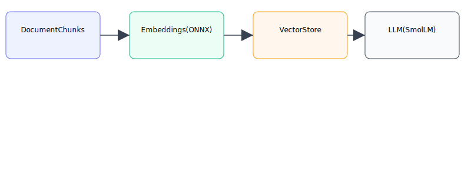
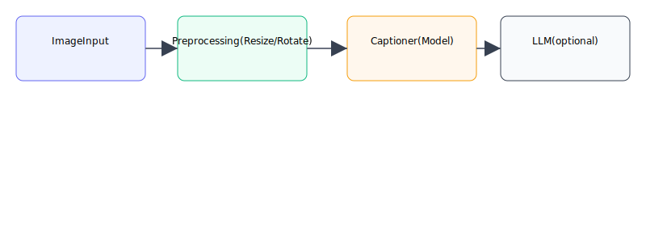
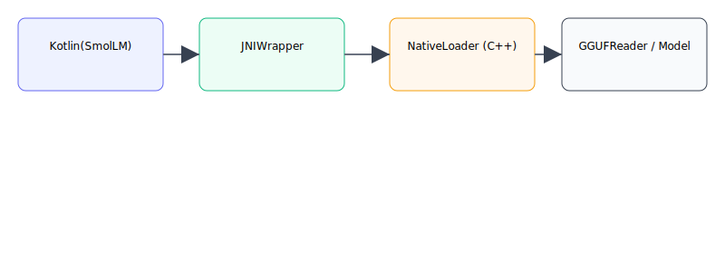

# Architecture

This page explains core high-level pipelines in `llmedge`: RAG flow, Image Captioning pipeline, and JNI/native model loading. Each section includes a small diagram and notes on important implementation details.

## RAG (Retrieval-Augmented Generation) flow

Diagram (RAG flow):

### Flow summary

1. Document ingestion: `PDFReader` / text input. Text is chunked by `TextSplitter`.
2. Embedding: For each chunk, an embedding is computed using an on-device embedding model (ONNX/ONNXRuntime or similar) via `EmbeddingProvider`.
3. Vector store: Chunks + embeddings are stored in `VectorStore` (simple on-device vector DB or file-backed store).
4. Query time: On a user question, `RAGEngine.retrievalPreview()` or `RAGEngine.contextFor()` performs nearest-neighbor search to produce a context.
5. LLM prompt: The retrieved context is included in a system or user prompt sent to `SmolLM` to generate a final answer.

### Implementation notes

- Chunk overlap and chunkSize matter: typical defaults: 600 tokens chunk, 120 overlap.
- Score thresholds: RAG implements filtering by score to avoid adding noisy context.
- On-device embedding models must be small/lightweight; prefer quantized ONNX models.

## Image Captioning pipeline

Diagram (image captioning):

### Flow summary

1. Capture or pick image (camera/file). Normalize orientation and scale to model input size.
2. Optionally run OCR (MlKit or other) to extract text first.
3. Run an image encoder/captioner to produce text caption or features.
4. If using LLM: convert caption/features into a prompt and call `SmolLM` to expand into richer descriptions.

### Implementation notes

- Resize images before sending to the model to avoid memory spikes.
- Use background threads (Dispatchers.IO) for image processing.

## JNI / Native model loading flow

Diagram (JNI loading):

### Flow summary

1. Kotlin calls `SmolLM.load(...)` or native loader method.
2. JNI wrapper forwards the path/params to native C++ (`LLMInference`, `GGUFReader`).
3. Native layer loads the GGUF model, builds internal tensors and attention caches, and returns a handle.
4. Kotlin uses the handle to call `infer`/`generate` functions. Streams are forwarded back to Kotlin via JNI callbacks or polling.
5. `close()` triggers native cleanup and frees memory.

### Implementation notes

- Avoid calling native load/generation on the main thread.
- Ensure ABIs packaged in `lib/` match device architecture (arm64-v8a is recommended for modern devices).
- Include `System.loadLibrary(...)` in a static initializer or trusted module; guard with try/catch and surface meaningful errors to the user.

## Key files

**RAG components:**

- `llmedge/src/main/java/io/aatricks/llmedge/rag/RAGEngine.kt`
- `llmedge/src/main/java/io/aatricks/llmedge/rag/EmbeddingProvider.kt`
- `llmedge/src/main/java/io/aatricks/llmedge/rag/VectorStore.kt`
- `llmedge/src/main/java/io/aatricks/llmedge/rag/PDFReader.kt`
- `llmedge/src/main/java/io/aatricks/llmedge/rag/TextSplitter.kt`

**Vision components:**

- `llmedge/src/main/java/io/aatricks/llmedge/vision/ImageUnderstanding.kt`
- `llmedge/src/main/java/io/aatricks/llmedge/vision/OcrEngine.kt`
- `llmedge/src/main/java/io/aatricks/llmedge/vision/ocr/MlKitOcrEngine.kt`
- `llmedge/src/main/java/io/aatricks/llmedge/vision/VisionModelAnalyzer.kt`

**Core LLM:**

- `llmedge/src/main/java/io/aatricks/llmedge/SmolLM.kt`
- `llmedge/src/main/java/io/aatricks/llmedge/GGUFReader.kt`
- `llmedge/src/main/cpp/` (native JNI implementation)

**Hugging Face integration:**

- `llmedge/src/main/java/io/aatricks/llmedge/huggingface/HuggingFaceHub.kt`
- `llmedge/src/main/java/io/aatricks/llmedge/huggingface/HFModelDownload.kt`

For more details, see the code in the repository and the `llmedge-examples` project which demonstrates each flow in practice.